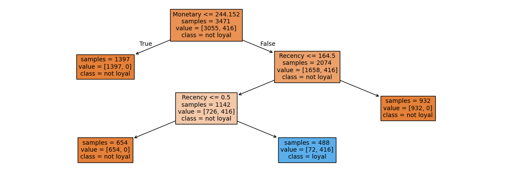

 
# Analysis of Customer Segmentation with RFM

by Jocelyn Miao

## Dashboard

[Tableau Dashboard Link](https://public.tableau.com/views/retail_17621348524080/Dashboard1?:language=en-US&publish=yes&:sid=&:redirect=auth&:display_count=n&:origin=viz_share_link)

## Overview

With more stores going online and tracking their data, how can companies keep track of their customers, and better yet, retain them? By using several methods of customer groupings, we can target and specialize tacticts on specific customers. I will be visualizing RFM, KMeans, and CLV models for customer segmentation in this project.

The dataset I will be using is [UCI Online Retail](https://archive.ics.uci.edu/dataset/352/online+retail), which "contains all the transactions occurring between 01/12/2010 and 09/12/2011 for a UK-based and registered non-store online retail." Here is a brief description of the dataset from UCI:

|Variable Name|	Role |	Description|
|--------|-------|--------|
|`InvoiceNo`|	ID|	A 6-digit integral number uniquely assigned to each transaction. If this code starts with letter 'c', it indicates a cancellation	
|`StockCode`|	ID|	Categorical	a 5-digit integral number uniquely assigned to each distinct product
|`Description`|	Feature |Categorical	product name	
|`Quantity`|	Feature	|Integer	the quantities of each product (item) per transaction	
|`InvoiceDate`|	Feature	|Date	the day and time when each transaction was generated
|`UnitPrice`|	Feature	|Continuous	product price per unit	(sterling)
|`CustomerID`|	Feature	|Categorical	a 5-digit integral number uniquely assigned to each customer
|`Country`|	Feature	|Categorical	the name of the country where each customer resides	

 

## Data Cleaning

To clean the dataset, columns with null values in `CustomerID` will be dropped, since there is no way to recover lost IDs that are needed for analysis. Duplicate rows and rows that correspond to the same transaction and refund were dropped. Rows with values `'POST'`, `DOT`, and `CRUK` in the `StockCode` column are used for postage or donations and do not contribute to sales data, so they were dropped. One thing to note is the StockCode `M` represents manual help, which could represent an item, refund, discount, or more (unknown), so I did not remove these rows. I removed leftover invoices starting with "C" to remove refund only transactions. Lastly, I created a column `TotalSale` that uses the quantity and price to describe the overall value of the transaction.

|   InvoiceNo | StockCode   | Description                         |   Quantity | InvoiceDate         |   UnitPrice |   CustomerID | Country        |   TotalSale |
|------------:|:------------|:------------------------------------|-----------:|:--------------------|------------:|-------------:|:---------------|------------:|
|      536365 | 85123A      | WHITE HANGING HEART T-LIGHT HOLDER  |          6 | 2010-12-01 08:26:00 |        2.55 |        17850 | United Kingdom |       15.3  |
|      536365 | 71053       | WHITE METAL LANTERN                 |          6 | 2010-12-01 08:26:00 |        3.39 |        17850 | United Kingdom |       20.34 |
|      536365 | 84406B      | CREAM CUPID HEARTS COAT HANGER      |          8 | 2010-12-01 08:26:00 |        2.75 |        17850 | United Kingdom |       22    |
|      536365 | 84029G      | KNITTED UNION FLAG HOT WATER BOTTLE |          6 | 2010-12-01 08:26:00 |        3.39 |        17850 | United Kingdom |       20.34 |
|      536365 | 84029E      | RED WOOLLY HOTTIE WHITE HEART.      |          6 | 2010-12-01 08:26:00 |        3.39 |        17850 | United Kingdom |       20.34 |

 

## Exploratory Analysis

What countries are users purchasing from? Outside of the United Kingdom being the majority, the dataset has users from several countries, with many from Germany and France.

<iframe
  src="assets/userdistribution.html"
  width="500"
  height="500"
  scrolling="no"
  frameborder="0"
></iframe>

In which month did customers make the most transactions? The month of November.
<iframe
  src="assets/mosttransactions.html"
  width="700"
  height="500"
  scrolling="no"
  frameborder="0"
></iframe>

 

## RFM Grouping

Now we can move on to calculating RFM scores for customers and grouping them for different sales tactics. I will be aggregating the dataframe to make columns for Recency (time since the customer last made a purchase), Frequency (how many transactions they make), and Monetary (how much total they have spent) values. Then we can convert this to a quartile rank from 1-5 as the actual RFM Segment. Below is the head of the new dataframe:

|   CustomerID |   Frequency |   Recency |   Monetary |   R |   F |   M |   RFM_Segment | Loyal   |
|-------------:|------------:|----------:|-----------:|----:|----:|----:|--------------:|:--------|
|        12346 |           1 |         0 |  77183.6   |   5 |   1 |   5 |           515 | False   |
|        12347 |           7 |       365 |    615.714 |   1 |   5 |   5 |           155 | False   |
|        12348 |           4 |       283 |    308.91  |   1 |   4 |   3 |           143 | False   |
|        12349 |           1 |         0 |   1457.55  |   5 |   1 |   5 |           515 | False   |
|        12350 |           1 |         0 |    294.4   |   5 |   1 |   3 |           513 | False   |

I will categorize customers with a score of `333` or higher to be Loyal, and customers under that to be Not Loyal. Below is the average recency, frequency, and monetary values of each group.

| Loyal   |   Recency |   Frequency |   Monetary |
|:--------|----------:|------------:|-----------:|
| False   |  137.585  |     3.98186 |    437.308 |
| True    |   81.9403 |     2.96269 |    544.037 |

<iframe
  src="assets/rfmc.html"
  width="500"
  height="500"
  scrolling="no"
  frameborder="0"
></iframe>

To create a model to predict loyalty, I chose a decision tree classifier model using the `sklearn` library. My model found an accuracy of 98% on determining if a customer would be loyal based off the recency, frequency, and monetary values of a customer.

 

## KMeans

Another method of clustering, KMeans, can be used to classify these users. I will use the Recency, Frequency, and Monetary values previously calculated and scale it, then use the elbow test to determine the number of clusters.

<iframe
  src="assets/elbow.html"
  width="500"
  height="500"
  scrolling="no"
  frameborder="0"
></iframe>

Here, around 4 clusters is the elbow point. Next we can make an actual model with 4 clusters, and add it to the dataframe for each customer. The dataframe below shows the mean for each category for each group.

|   Cluster |   Recency |   Frequency |   Monetary |
|----------:|----------:|------------:|-----------:|
|         0 |    27.508 |     1.61218 |    395.742 |
|         1 |   352.211 |    28.7719  |    793.778 |
|         2 |   102.5   |     1.5     |  80709.9   |
|         3 |   265.28  |     5.45686 |    414.016 |

<iframe
  src="assets/clusteringusers.html"
  width="500"
  height="500"
  scrolling="no"
  frameborder="0"
></iframe>

The groups are:
- 0: High frequency customers: promote higher monetary sales
- 1: New customers: entice with limited-time discounts
- 2: High spending customers: reward with wholesale discounts 
- 3: Average customers: promote with points rewards

The difference between RFM and KMeans is we have much more distinguished groups based on distances as shown in the graph, while the RFM analysis had overlaping customers in different areas. KMeans tended to group customers more on features, so different sales tactics can be targeted towards these features.

 

## Modeling CLV

Let's move on to finding the customer lifetime value of these customers for one year. I will be using the `BetaGeoFitter` and `GammaGammaFitter` from the `lifetimes` package to calculate the CLV. Customers with only one purchase will be filtered out for the models.

The Beta-Geometric/NBD model is a type of Buy Till You Die model that describes the dropout process of customers and can predict how many transactions a customer will make. I will combine this with the Gamma-Gamma Submodel can predict the profit for each customer. After fitting both models, we can use the `customer_lifetime_value` function under the Gamma-Gamma model to create a column for the dataframe with the CLV of each customer, and graph this with the RFM graph.

|   CustomerID |   frequency |   recency |   T |   monetary_value |      CLV |   group |
|-------------:|------------:|----------:|----:|-----------------:|---------:|--------:|
|        12347 |           6 |       365 | 367 |          599.702 | 3007.45  |       4 |
|        12348 |           3 |       283 | 358 |          261.48  |  911.965 |       2 |
|        12352 |           6 |       260 | 296 |          244.29  | 1705.14  |       3 |
|        12356 |           2 |       303 | 325 |          269.905 |  774.421 |       1 |
|        12358 |           1 |       149 | 150 |          523.2   | 1300.52  |       2 |

Here are the descriptive statistics for `CLV`:

|       |        CLV |
|:------|-----------:|
| count |   2784     |
| mean  |   2662.11  |
| std   |   8683.81  |
| min   |    312.874 |
| 25%   |    817.444 |
| 50%   |   1366.32  |
| 75%   |   2364.95  |
| max   | 221407     |

<iframe
  src="assets/clv.html"
  width="500"
  height="500"
  scrolling="no"
  frameborder="0"
></iframe>

We can see that most customers have a CLV around the mean but there are a few outliers with high scores. CLV values can also be used to create sementations for customers (as seen in the `Group` column, like with RFM earlier).

The BGF model can also be used to predict the how many purchases customers will make within the next 30 days (and many other predictions). Here are the top 5 for this dataset:

|   CustomerID |   Expected Purchases |
|-------------:|---------------------:|
|        14911 |              8.9461  |
|        12748 |              7.72459 |
|        17841 |              7.5888  |
|        15311 |              6.09582 |
|        14606 |              6.02791 |

Overall, there are several ways to segment customers with different benefits and drawbacks depending on what analysis should be done on customer databases. With more data on customers, we could extend our modeling to predicting what customers will buy and when.